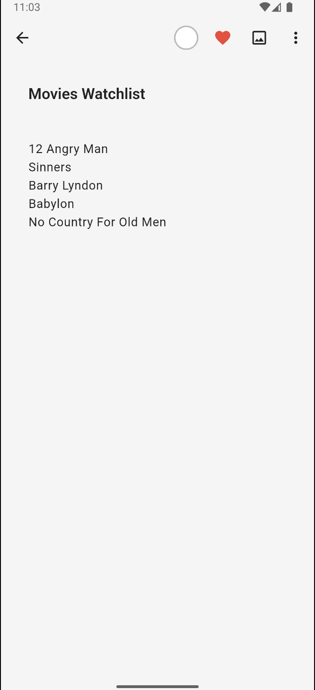
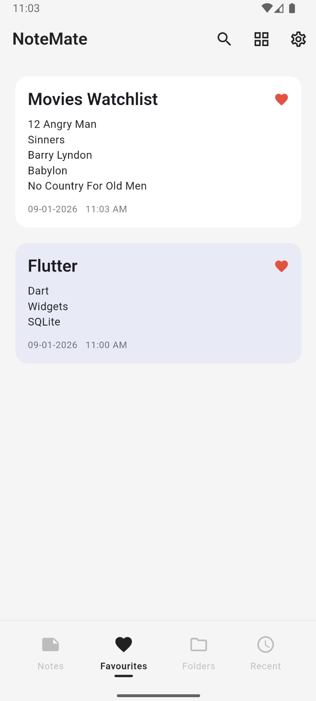
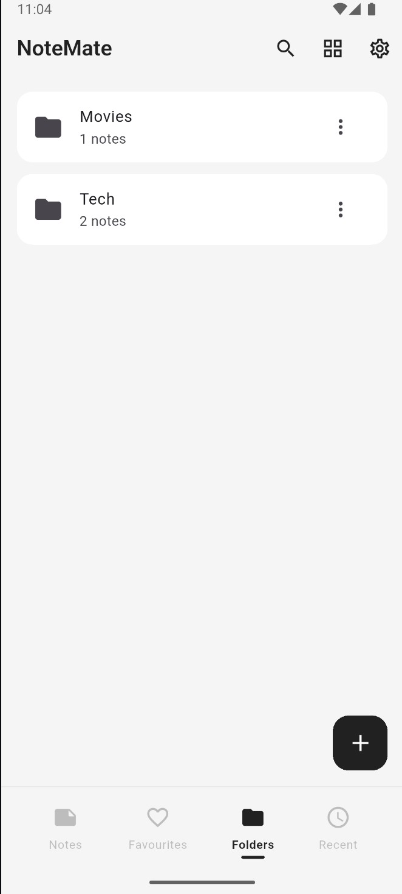
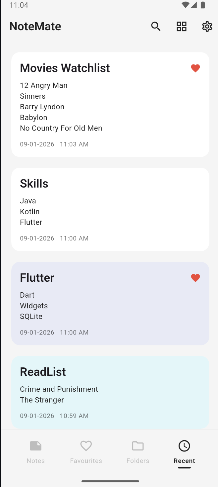
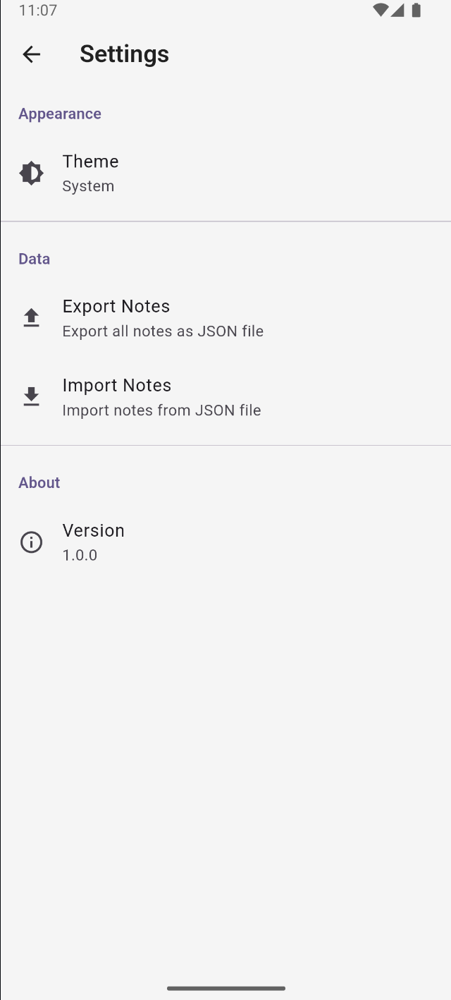
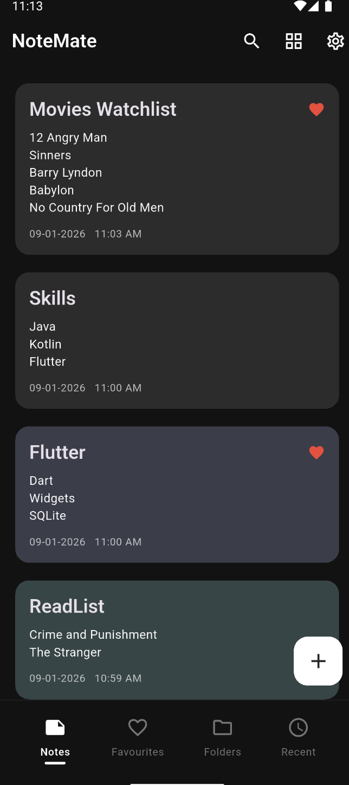

# NoteMate 📝

NoteMate is a clean and fast notes application built with Flutter.  
It helps users write, organize, and quickly find important notes, with full offline support and dark/light themes.

This project focuses on writing clean Flutter code and implementing local data persistence the right way.

---

## 📱 Screenshots

### Home Screen


### Add Note


### Favourites


### Folders


### Recents


### Settings


### Dark Theme


---

## ✨ Features
- Create, edit, and delete notes
- Mark important notes as favorites
- Instant search across all notes
- Dark mode and light mode support
- Fully offline functionality
- Persistent local storage

---

## 🛠 Tech Stack
- Flutter
- Dart
- SQLite (local database)
- Shared Preferences (settings & theme)

---

## 🚀 Getting Started

### Prerequisites
- Flutter SDK
- Android Studio or VS Code
- Android Emulator or physical device

### Steps
1. Clone the repository
   ```bash
   git clone https://github.com/your-username/NoteMate.git
   ```
2. Open the project in Android Studio or VS Code
3. Run `flutter pub get`
4. Start an emulator or connect a device
5. Run the app using:
   ```bash
   flutter run
   ```

---

## 📚 What I Learned
- Flutter state management fundamentals
- Working with SQLite for offline-first apps
- Using Shared Preferences for persistent settings
- Building clean and reusable UI components
- Implementing search functionality efficiently

---

## 🔮 Future Improvements
- Cloud sync support
- Note categories and tags
- Reminder notifications
- Rich text formatting

---

## 👨‍💻 Author
**Kaushal Mistry**  
Flutter / Android Developer  
GitHub: https://github.com/kaushalmistry5
